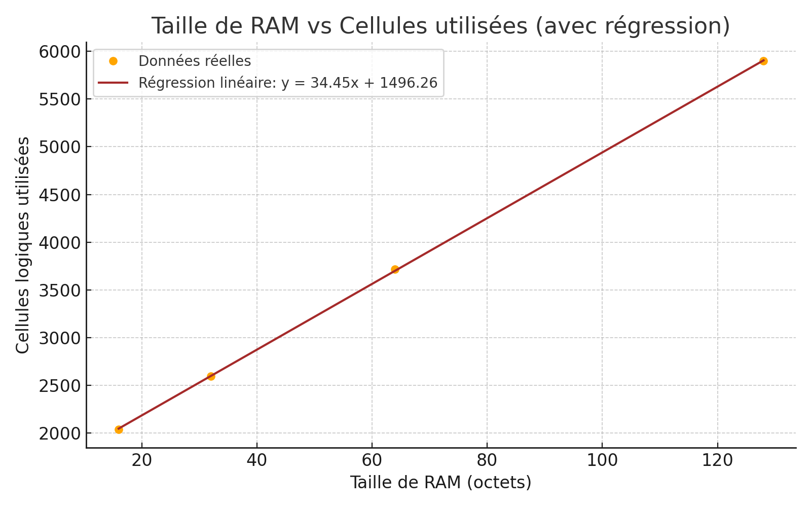

> 🔗 Ce dépôt contient le projet **CPU 16 bits en Verilog**, implémenté avec le template **TinyTapeout**.  
> 📂 Retrouvez tout le code source ici : [Voir le dépôt GitHub](https://github.com/Maleek-Bejaoui/CPU_vF)

# Estimation de la Consommation Logique d’un CPU 16 bits en ASIC (TinyTapeout)

## Introduction
Ce projet vise à estimer le nombre de cellules logiques utilisées par un processeur 16 bits avant la phase d’implantation physique en ASIC. Le processeur est développé avec la plateforme [TinyTapeout](https://github.com/TinyTapeout/tt10-verilog-template).

## Objectif
- Concevoir un CPU 16 bits fonctionnel avec RAM intégrée
- Étudier l’impact de la taille de la RAM sur les ressources logiques consommées
- Déduire une relation mathématique permettant d’anticiper cette consommation

## Méthodologie
Pour chaque test :
- Déclaration de la RAM : `reg [15:0] memory [0:N];`
- Synthèse du design via TinyTapeout
- Lecture du fichier `summary.json`
- Extraction du nombre de cellules logiques (hors fill/tap)
- Régression linéaire sur les données collectées

## Résultats

| RAM (octets) | Cellules utilisées |
|--------------|--------------------|
| 16           | 2040               |
| 32           | 2595               |
| 64           | 3719               |
| 128          | 5898               |



## Régression Linéaire

L’équation obtenue est :

```
y = 34.45x + 1496.26
```

où :
- `x` est la taille de la RAM (en octets)
- `y` est le nombre de cellules logiques estimées

Exemple : pour 256 octets de RAM → `y ≈ 10314 cellules`

## Conclusion
Ce modèle permet de prédire rapidement la consommation logique d’un CPU 16 bits selon la taille de la RAM embarquée. Cela facilite les choix d’architecture et d’optimisation en phase de pré-implantation.

---

> Ce projet a été réalisé par Cossec Célian et moi-même, sous la supervision de M. Mathieu Escouteloup.
